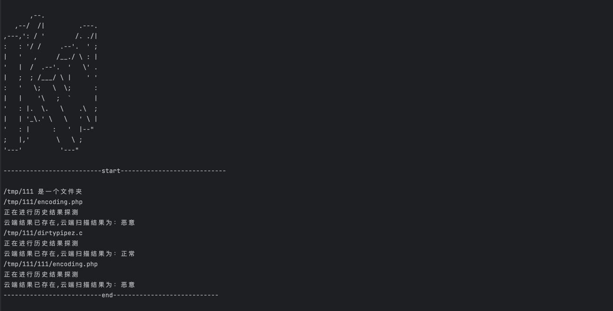
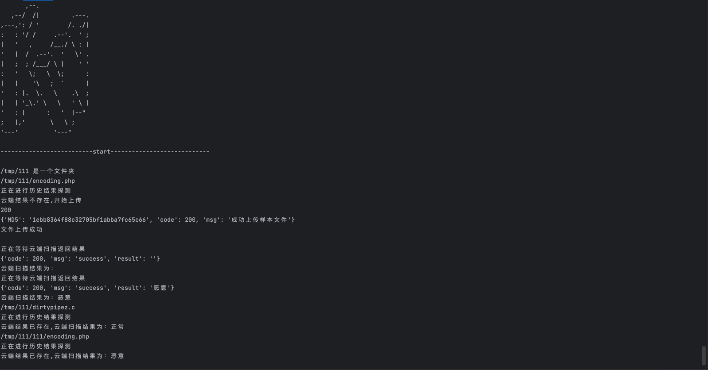

# PyKunwu_Cli

## 本项目为Kunwu_Cli的Python重构版本

### 原项目地址为：https://github.com/kunwu2023/kunwu/

在基于原项目的基础上加入了异步检测的代码，并进行了部分优化。
### 原项目介绍：
 默安科技打造的新一代 WebShell 检测工具「KunWu」

集模糊规则、污点分析模拟执行、机器学习三种高效检测策略，精准无误地发现 WebShell 风险
### 本项目的使用方法：
#### 1. 安装依赖包
    pip install -r requirements.txt
#### 2. 运行
    python3 main.py --path /path/to/file
#### 3. 运行结果示例

### 4. 项目结构
| 名称        | 说明         |
|-----------|------------|
| main.py   | 程序入口点      |
| Scan.py   | 扫描模块核心代码   |
| config.py | 工具模块代码     |
| logo.py   | 程序logo     |
| config.py | 程序配置文件     |
|-----------| ---------- |

